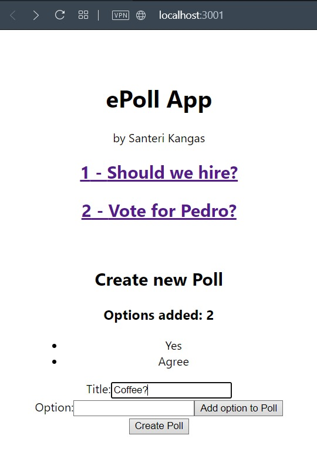
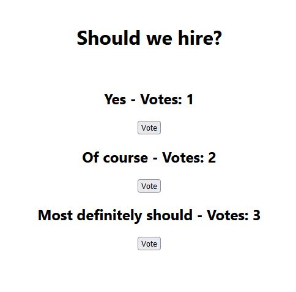

# ePoll applications

This directory contains implementations for backend(with persistent storage) and frontend for an 'ePoll' application - by Santeri Kangas.

## Backend

Follow the instructions for running the backend server in poll-backend directory.

```
cd poll-backend
```

## Frontend

Follow the instructions for running the frontend server in poll-frontend directory.

```
cd poll-frontend
```

## Preview

### Demo: Demo run


### Frontend: Create new poll and list existing polls


### Frontend: View and vote for options in a poll
